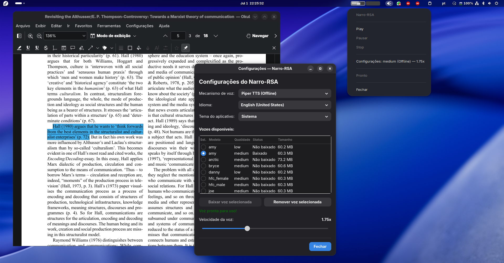

# Narro - Read Selection Aloud

Leitor de texto em voz alta com suporte a Edge TTS (online) e Piper TTS (offline) para o GNOME/Wayland.

Selecione texto em qualquer aplicativo, copie com Ctrl+C, e use um atalho de teclado para abrir o player TTS — com controles de Play/Pause/Stop, seleção de motor/idioma/voz e controle de velocidade.





## Funcionalidades

- Controles completos de reprodução (Play, Pause, Stop).
- Dois motores de síntese suportados: Edge TTS (vozes neurais da nuvem) e Piper TTS (vozes locais ultrarrápidas rodando totalmente offline).
- Nova aba de seleção de voz estruturada em: Voz -> Engine (Edge TTS ou Piper TTS) -> Língua -> Selecionar.
- Diálogo de configuração nativo em GTK3 que permite listar as vozes disponíveis, visualizar o status de download do modelo local (para o Piper) e baixá-los diretamente pela interface com uma barra de progresso em tempo real.
- As vozes baixadas do Piper são guardadas em uma pasta local do usuário (~/.config/narro-rsa/piper-voices/).
- Controle de velocidade em tempo real via mpv (aplicável a ambos os motores).
- Interface GTK nativa integrada visualmente com o GNOME.
- Texto editável para correções rápidas antes de iniciar a leitura.
- Barra de status com informações de feedback do processo.

## Dependências

| Pacote | Instalação |
|---|---|
| edge-tts | pipx install edge-tts |
| piper-tts | pipx install piper-tts ou instale o binário do piper no PATH (ex: ~/.local/bin/piper) |
| mpv | sudo dnf install mpv |
| wl-clipboard | sudo dnf install wl-clipboard |
| python3-gobject | sudo dnf install python3-gobject |
| gtk3 | sudo dnf install gtk3 |
| libnotify | sudo dnf install libnotify |

Comandos para instalação das dependências:

```bash
sudo dnf install wl-clipboard mpv python3-gobject gtk3 libnotify
pipx install edge-tts
```

Nota: Para usar o Piper TTS, garanta que o binário do `piper` esteja disponível no seu PATH de execução ou instalado diretamente em `~/.local/bin/piper`.

## Instalação

```bash
git clone https://github.com/geraldohomero/narro-rsa.git
cd narro-rsa
bash install.sh
```

O script `install.sh` copia os arquivos necessários para `~/.local/bin/` e verifica as dependências.

## Desinstalação

Para remover completamente o Narro-RSA do sistema:

```bash
bash uninstall.sh
```

O script remove:
- Scripts instalados em `~/.local/bin/`
- Configurações salvas e vozes locais do Piper em `~/.config/narro-rsa/`
- Arquivos temporários e buffers de áudio em `/tmp/`
- Processos em andamento (mpv, edge-tts, piper)

Após desinstalar, lembre-se de remover manualmente os atalhos de teclado configurados no GNOME.

## Configuração dos atalhos no GNOME

Abra: Configurações -> Teclado -> Atalhos de teclado -> Atalhos personalizados

### Atalho 1 — Abrir Leitor TTS
- Nome: Leitor TTS
- Comando: `bash -c "$HOME/.local/bin/ler_texto.sh"`
- Atalho sugerido: Super+Alt+L

### Atalho 2 — Parar leitura (opcional)
- Nome: Parar leitura TTS
- Comando: `bash -c "$HOME/.local/bin/parar_leitura.sh"`
- Atalho sugerido: Super+Alt+K

## Como usar

1. Abra um documento ou PDF (por exemplo, no Okular).
2. Selecione o texto desejado com a ferramenta de seleção.
3. Copie com Ctrl+C.
4. Pressione Super+Alt+L (ou o atalho configurado).
5. O player abrirá na tray do sistema.
6. Vá em Voz -> Escolha o motor (Edge TTS ou Piper TTS) -> Escolha o idioma -> Clique em Selecionar.
7. No diálogo que se abrirá, escolha a voz desejada. Caso esteja configurando o Piper, clique em "Baixar voz selecionada" antes de confirmar a seleção.
8. Clique em Play para iniciar a leitura.
9. Use Pause para pausar/retomar e Stop para parar.

## Estrutura do Projeto

```
narro-rsa/
├── ler_texto.py       # App GTK principal (player com controles e diálogos de download)
├── ler_texto.sh       # Wrapper shell para atalho do GNOME
├── parar_leitura.sh   # Script para interromper a leitura
├── install.sh         # Instalador do sistema
├── uninstall.sh       # Desinstalador (limpa arquivos, configurações e vozes locais)
└── README.md          # Documentação do projeto
```

## Licença

MIT
