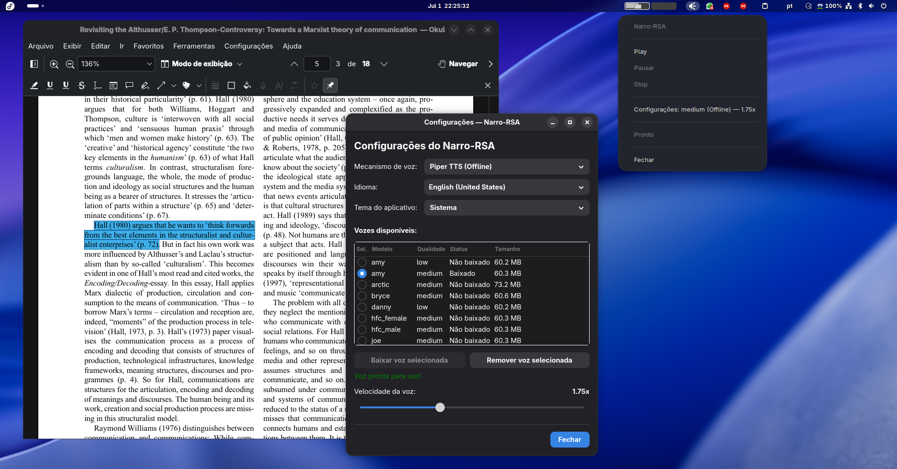

# Narro - Read Selection Aloud

<p align="center">
  
</p>

[English](README.md) | [Português (Brasil)](README.pt-br.md) | [简体中文](README.zh-cn.md)

Text-to-speech (TTS) reader with support for Edge TTS (online) and Piper TTS (offline) for GNOME/Wayland, featuring a fully integrated GTK4 native application and Flatpak support.

Select text in any application, copy it, and use a keyboard shortcut to open the TTS player — featuring Play/Pause/Stop controls, engine/language/voice selection, speed control, and a visual history viewer.



## Features

- **Integrated GTK4 Native Window**: View, edit and read clipboard text directly from a beautiful GNOME HIG interface.
- **Sober Desktop Icon**: Custom transparent document icon matching GNOME/Flatpak desktop environments.
- **Two TTS Engines**: Edge TTS (neural cloud voices) and Piper TTS (ultra-fast local voices running completely offline).
- **Auto-Configured Keyboard Shortcuts**: Automatically sets up GNOME global hotkeys on the first launch.
- **Dynamic Settings Dialog**: Inside the main window, view voice catalogs, download local models for Piper with real-time progress bars, and set preferences.
- **Real-Time Speed Control**: Adjust playback speed on the fly via mpv integration.
- **System Tray Integration**: An optional system tray indicator (AppIndicator) running on the host that lets you trigger/open the app quickly.

---

## Installation Options

### Option 1: Flatpak (Recommended & Fully Self-Contained)

Installing via Flatpak is the easiest method. It bundles all dependencies inside a sandbox, requires no manual configuration of libraries on your host system, and sets up GNOME keyboard shortcuts automatically.

#### 1. Build and install the Flatpak package locally:
```bash
flatpak-builder --user --install --force-clean --disable-rofiles-fuse build-dir com.github.geraldohomero.NarroRsa.yaml
```

#### 2. Run the application:
```bash
flatpak run com.github.geraldohomero.NarroRsa
```

*(On the first GUI startup, GNOME custom keyboard shortcuts will be configured automatically to use Flatpak!)*

---

### Option 2: Traditional Installation (Host Script)

If you prefer to run the application directly on the host using your system Python interpreter:

#### 1. Install System Dependencies:
- **Fedora**: `sudo dnf install wl-clipboard mpv libnotify python3-gobject gtk3 gtk4 libappindicator-gtk3`
- **Ubuntu/Debian**: `sudo apt install wl-clipboard mpv libnotify-bin python3-gi gir1.2-gtk-3.0 gir1.2-gtk-4.0 gir1.2-ayatanaappindicator3-0.1`
- **Arch Linux**: `sudo pacman -S wl-clipboard mpv libnotify python-gobject gtk3 gtk4 libayatana-appindicator`

#### 2. Install Python TTS Engines:
```bash
pipx install edge-tts
pipx install piper-tts  # Optional for offline local TTS
```

#### 3. Run the installer:
```bash
git clone https://github.com/geraldohomero/narro-rsa.git
cd narro-rsa
bash install.sh
```

---

## GNOME Keyboard Shortcuts

The app configures these shortcuts automatically on GNOME. The corresponding commands differ depending on your installation:

### For Flatpak Installation:
- **Read Clipboard** (`Super+Alt+L`): `flatpak run com.github.geraldohomero.NarroRsa --play`
- **Read Selection Direct** (`Ctrl+\`): `flatpak run com.github.geraldohomero.NarroRsa --primary`
- **Pause/Resume** (`Super+Alt+J`): `flatpak run com.github.geraldohomero.NarroRsa --pause`
- **Stop Playback** (`Super+Alt+K`): `flatpak run com.github.geraldohomero.NarroRsa --stop`

### For Traditional Installation:
- **Read Clipboard** (`Super+Alt+L`): `bash -c "$HOME/.local/bin/ler_texto.sh"`
- **Read Selection Direct** (`Ctrl+\`): `bash -c "$HOME/.local/bin/ler_texto.sh --primary"`
- **Pause/Resume** (`Super+Alt+J`): `bash -c "$HOME/.local/bin/pausar_leitura.sh"`
- **Stop Playback** (`Super+Alt+K`): `bash -c "$HOME/.local/bin/parar_leitura.sh"`

---

## Uninstallation

### To uninstall the Flatpak app:
```bash
flatpak remove com.github.geraldohomero.NarroRsa
```

### To uninstall host scripts:
```bash
bash uninstall.sh
```

---

## Project Structure

```
narro-read-selection-aloud/
├── main_window.py         # Entrypoint & GTK4 Main Window (with Gtk.Stack and Hamburger menu)
├── ler_texto.py           # AppIndicator3 tray daemon launcher (GTK3)
├── narro_rsa/             # Python package with project logic
│   ├── translations.py    # Centralized translations & formatting helper
│   ├── reader_page.py     # Reader UI GTK4 component
│   ├── settings_page.py   # Settings UI GTK4 component
│   ├── constants.py       # Centralized paths and constants
│   ├── settings.py        # Preferences loader
│   ├── mpv_control.py     # IPC Unix socket controls for mpv
│   ├── text_formatter.py  # Text cleanup for PDF reading
│   ├── clipboard.py       # Wayland clipboard capture
│   ├── subprocess_helper.py # Daemon and process utilities
│   └── tts_engine.py      # Audio generator (Edge-TTS + Piper)
├── com.github.geraldohomero.NarroRsa.yaml         # Flatpak Manifest
├── com.github.geraldohomero.NarroRsa.desktop      # Desktop entry
├── com.github.geraldohomero.NarroRsa.metainfo.xml # AppStream Metadata
├── install.sh             # Host installer script
└── assets/                # Icon and visual resources
```

## License

MIT
